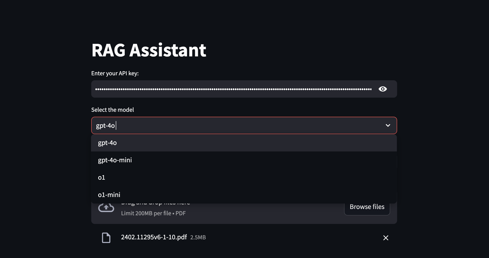
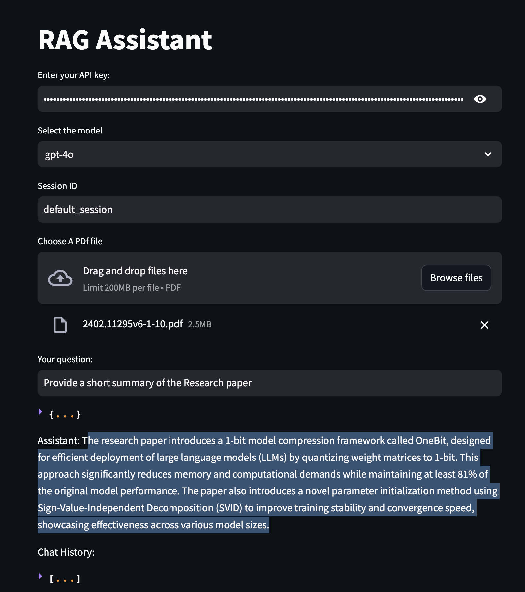

# RAG-Assistant

RAG Assistant is a Retrieval-Augmented Generation (RAG) chatbot application built with Streamlit, designed to answer user questions with the help of uploaded documents (PDF files) and contextual retrieval from OpenAI's language models. This project utilizes embeddings and a vector database to enhance retrieval and provide concise, context-aware answers.


### Features

- **PDF Upload and Processing**: Upload multiple PDF documents, which are processed and split into chunks for efficient retrieval.
- **Embeddings**: Embeddings are generated using OpenAI's text-embedding-3-large model.
- **Vector Database**: Powered by Chroma, it stores and retrieves document embeddings for context-aware answering.
- **Chat History Management**: Maintains a stateful chat history for each session using Streamlit.
- **Standalone Question Reformulation**: Reformulates user questions based on chat history to ensure clarity.
- **LLM Integration**: Supports OpenAI models (`gpt-4o`, `gpt-4o-mini`, `o1`, `o1-mini`) for generating answers.
- **Conversational Context**: Provides answers tailored to user queries by leveraging both document context and chat history.

## Example: Research Paper Used

This project demonstrates the retrieval-augmented answering process using the research paper:

**"OneBit: Towards Extremely Low-bit Large Language Models"**

The paper discusses the development of extremely low-bit large language models, focusing on the OneBit quantization method to reduce the model size and computational cost.

Example Question and Response:

Below are screenshots of question asked about the "OneBit" paper and the RAG Assistant's responses:

### Uploading the "OneBit" Research Paper


### Example Question and RAG Assistant's Response



### Prerequisites
#### Tools and Libraries

- Python 3.9+
- Streamlit
- LangChain
- OpenAI Python SDK
- HuggingFace Embeddings
- Chroma for vector storage
- pyPDFLoader for PDF processing

#### Environment Setup

1. Clone the repository and navigate to the project directory.
```{bash}
git clone <[repo-url](https://github.com/malharnd/RAG-Assistant.git)>
```

2. Install Dependencies
Install the required Python packages:
```{bash}
pip install -r requirements.txt
```

3. Environment Setup
Create a .env file in the project root and define the required environment variables:
```{bash}
OPENAI_API_KEY=<your-openai-api-key>
```


#### Usage

Run the Application
```{bash}
streamlit run app.py
```


#### Steps

1. Enter **Your OpenAI API Key**: Input your OpenAI API key in the application interface.
2. Select the **LLM Model**: Choose from the available models (`gpt-4o`, `gpt-4o-mini`, `o1`, `o1-mini`).
3. Upload PDFs: Upload one or multiple PDF files for context retrieval.
4. Ask Questions: Type your question in the chat input box. The system will respond with concise answers based on the uploaded documents and chat context.
5. View Chat History: The application maintains a persistent chat history for each session.

#### Key Concepts
- Retrieval-Augmented Generation (RAG): Combines retrieval systems with language models to enhance the context for answering user queries.
 
- Chroma: A lightweight and efficient vector database for embedding storage and retrieval.
- LangChain: A framework for developing applications with language models, document loaders, retrievers, and chat interfaces.


### Future Enhancements
I plan on also Integrate open-source models like `Google Gemma` and `Meta LLaMA` models to provide broader accessibility and reduce dependency on proprietary APIs.


